# an-fetch API 完整参考文档

## 📋 目录

- [核心API](#核心api)
- [便捷方法API](#便捷方法api)
- [类型系统](#类型系统)
- [错误处理API](#错误处理api)
- [数据转换器API](#数据转换器api)
- [工具函数API](#工具函数api)
- [API关联关系图](#api关联关系图)

---

## 🚀 核心API

### Service函数

**主要入口函数，用于创建API实例**

| 函数签名 | 参数 | 返回值 | 描述 |
|---------|------|--------|------|
| `service(globalConfig?, apiConfig?)` | `GlobalConfig`, `Record<string, ApiConfig>` | `ServiceResult` | 创建配置化的API实例 |

#### 配置接口

| 接口名 | 属性 | 类型 | 默认值 | 描述 |
|--------|------|------|--------|------|
| **GlobalConfig** | | | | 全局配置 |
| | baseURL | `string?` | `''` | 基础URL |
| | timeout | `number?` | `30000` | 超时时间(ms) |
| | timeoutRetry | `boolean?` | `false` | 超时是否重试 |
| | timeoutRetryCount | `number?` | `0` | 超时重试次数 |
| | retry | `boolean?` | `false` | 失败是否重试 |
| | retryCount | `number?` | `0` | 重试次数 |
| | retryInterval | `number?` | `0` | 重试间隔(ms) |
| | cancelRepeatedRequests | `boolean?` | `false` | 取消重复请求 |
| | credentials | `CredentialsType?` | `undefined` | 凭据模式 |

| 接口名 | 属性 | 类型 | 描述 |
|--------|------|------|------|
| **ApiConfig** | | | 单个API配置 |
| | path | `string?` | API路径 |
| | method | `string?` | HTTP方法 |
| | query | `Record<string, unknown>?` | 查询参数 |
| | body | `unknown?` | 请求体 |
| | headers | `Record<string, string>?` | 请求头 |
| | dataType | `ContentType?` | 数据类型 |
| | signal | `AbortSignal?` | 取消信号 |
| | ...GlobalConfig | | 继承全局配置 |

#### 使用示例

```typescript
// 基础使用
const api = service({
  baseURL: 'https://api.example.com',
  timeout: 10000,
  retry: true,
  retryCount: 3
}, {
  getUsers: {
    path: 'users',
    method: 'GET'
  },
  createUser: {
    path: 'users',
    method: 'POST',
    dataType: 'json'
  }
});

// 调用API
const users = await api.getUsers().send();
const newUser = await api.createUser().send({
  body: { name: 'John', email: 'john@example.com' }
});
```

---

## 🔧 便捷方法API

### HTTP方法函数

**类似axios的便捷方法，支持泛型**

| 方法 | 签名 | 返回值 | 描述 |
|------|------|--------|------|
| `get<T>` | `(url: string, config?: RequestConfig)` | `Promise<T>` | GET请求 |
| `post<T, D>` | `(url: string, data?: D, config?: RequestConfig)` | `Promise<T>` | POST请求 |
| `put<T, D>` | `(url: string, data?: D, config?: RequestConfig)` | `Promise<T>` | PUT请求 |
| `delete<T>` | `(url: string, config?: RequestConfig)` | `Promise<T>` | DELETE请求 |
| `patch<T, D>` | `(url: string, data?: D, config?: RequestConfig)` | `Promise<T>` | PATCH请求 |
| `head<T>` | `(url: string, config?: RequestConfig)` | `Promise<T>` | HEAD请求 |
| `options<T>` | `(url: string, config?: RequestConfig)` | `Promise<T>` | OPTIONS请求 |

### 并发处理方法

| 方法 | 签名 | 返回值 | 描述 |
|------|------|--------|------|
| `all<T>` | `(promises: Promise<T>[])` | `Promise<T[]>` | 并行执行所有请求 |
| `race<T>` | `(promises: Promise<T>[])` | `Promise<T>` | 竞速执行，返回最快的 |

#### 使用示例

```typescript
// 基础请求
const user = await get<User>('/api/users/1');
const newUser = await post<User, CreateUserData>('/api/users', userData);

// 并发请求
const [users, posts, comments] = await all([
  get<User[]>('/api/users'),
  get<Post[]>('/api/posts'),
  get<Comment[]>('/api/comments')
]);

// 竞速请求
const fastestResponse = await race([
  get('/api/data-source-1'),
  get('/api/data-source-2'),
  get('/api/data-source-3')
]);
```

---

## 🔌 拦截器API

### Interceptors接口

| 拦截器类型 | 方法 | 签名 | 描述 |
|------------|------|------|------|
| **request** | use | `(callback, errorCallback?)` | 请求拦截器 |
| **response** | use | `(callback, errorCallback?)` | 响应拦截器 |

#### 回调函数类型

| 类型 | 签名 | 描述 |
|------|------|------|
| RequestInterceptor | `(config: ApiConfig) => ApiConfig \| Promise<ApiConfig>` | 请求拦截器回调 |
| ResponseInterceptor | `(response: Response) => unknown \| Promise<unknown>` | 响应拦截器回调 |

#### 使用示例

```typescript
// 请求拦截器
service.interceptors.request.use(async (config) => {
  config.headers = config.headers || {};
  config.headers['Authorization'] = `Bearer ${getToken()}`;
  return config;
});

// 响应拦截器
service.interceptors.response.use(
  (response) => response.json(),
  (error) => {
    console.error('请求失败:', error);
    return Promise.reject(error);
  }
);
```

---

## 📊 类型系统

### 核心类型定义

| 类型名 | 定义 | 用途 |
|--------|------|------|
| `HttpMethod` | `'GET' \| 'POST' \| 'PUT' \| 'DELETE' \| 'PATCH' \| 'HEAD' \| 'OPTIONS'` | HTTP方法 |
| `ResponseType` | `'json' \| 'text' \| 'blob' \| 'arrayBuffer'` | 响应类型 |
| `ContentType` | `'json' \| 'form-urlencoded' \| 'form-data' \| 'html' \| 'xml'` | 内容类型 |
| `CredentialsType` | `'omit' \| 'same-origin' \| 'include'` | 凭据类型 |

### 泛型接口

| 接口名 | 泛型参数 | 描述 |
|--------|----------|------|
| `AxiosLikeResponse<T>` | `T = unknown` | 类型安全的响应 |
| `TypedRequestConfig<T>` | `T = unknown` | 类型安全的请求配置 |
| `TypedApiClient<TApiDef>` | `TApiDef extends ApiDefinition` | 类型安全的API客户端 |

#### AxiosLikeResponse接口

| 属性 | 类型 | 描述 |
|------|------|------|
| data | `T` | 响应数据 |
| status | `number` | 状态码 |
| statusText | `string` | 状态文本 |
| headers | `Record<string, string>` | 响应头 |
| config | `AxiosLikeRequestConfig` | 请求配置 |

### 进度事件类型

| 接口名 | 属性 | 类型 | 描述 |
|--------|------|------|------|
| **ProgressEvent** | | | 进度事件 |
| | loaded | `number` | 已加载字节数 |
| | total | `number` | 总字节数 |
| | lengthComputable | `boolean` | 是否可计算长度 |
| | percentage | `number` | 完成百分比 |

---

## ❌ 错误处理API

### HTTP状态码常量

| 常量组 | 范围 | 说明 |
|--------|------|------|
| `HTTP_STATUS` | 100-511 | 完整的HTTP状态码定义 |

#### 状态码分类函数

| 函数名 | 签名 | 返回值 | 描述 |
|--------|------|--------|------|
| `isInformational` | `(status: number)` | `boolean` | 1xx 信息性状态码 |
| `isSuccess` | `(status: number)` | `boolean` | 2xx 成功状态码 |
| `isRedirection` | `(status: number)` | `boolean` | 3xx 重定向状态码 |
| `isClientError` | `(status: number)` | `boolean` | 4xx 客户端错误 |
| `isServerError` | `(status: number)` | `boolean` | 5xx 服务器错误 |
| `isError` | `(status: number)` | `boolean` | 4xx或5xx错误 |

### 错误处理工具

| 函数名 | 签名 | 返回值 | 描述 |
|--------|------|--------|------|
| `createHttpError` | `(message, status?, statusText?, response?, config?, code?)` | `HttpError` | 创建HTTP错误 |
| `createErrorFromResponse` | `(response, config)` | `HttpError` | 从响应创建错误 |
| `createStatusValidator` | `(validStatuses?)` | `(status: number) => boolean` | 创建状态验证器 |
| `getStatusMessage` | `(status: number)` | `string` | 获取状态描述 |

### 错误分类器

| 类名 | 静态方法 | 签名 | 描述 |
|------|----------|------|------|
| **ErrorClassifier** | | | 错误分类器 |
| | isNetworkError | `(error: Error) => boolean` | 网络错误检测 |
| | isTimeoutError | `(error: Error) => boolean` | 超时错误检测 |
| | isAbortError | `(error: Error) => boolean` | 取消错误检测 |

#### HttpError接口

| 属性 | 类型 | 描述 |
|------|------|------|
| status | `number?` | HTTP状态码 |
| statusText | `string?` | 状态文本 |
| response | `AxiosLikeResponse?` | 响应对象 |
| config | `AxiosLikeRequestConfig?` | 请求配置 |
| code | `string?` | 错误代码 |

---

## 🔄 数据转换器API

### 请求转换器

| 转换器类 | 静态方法 | 功能 |
|----------|----------|------|
| **RequestTransformers** | | 请求数据转换 |
| | jsonStringify | JSON序列化 |
| | urlEncoded | URL编码 |
| | formData | FormData转换 |
| | flattenArray | 数组扁平化 |
| | camelToSnake | 驼峰转下划线 |
| | removeEmpty | 移除空值 |
| | validate(schema) | 数据验证 |
| | compose(...transformers) | 转换器组合 |

### 响应转换器

| 转换器类 | 静态方法 | 功能 |
|----------|----------|------|
| **ResponseTransformers** | | 响应数据转换 |
| | jsonParse | JSON解析 |
| | extractData(field) | 提取数据字段 |
| | wrapArray | 数组包装 |
| | snakeToCamel | 下划线转驼峰 |
| | parseDate(fields) | 日期解析 |
| | parseNumbers(fields) | 数字解析 |
| | mapFields(mapping) | 字段映射 |
| | filterFields(fields) | 字段过滤 |

### 通用转换器

| 转换器类 | 静态方法 | 功能 |
|----------|----------|------|
| **CommonTransformers** | | 通用转换 |
| | identity | 恒等转换 |
| | log(label) | 日志转换 |
| | cache(key, ttl) | 缓存转换 |
| | retry(options) | 重试转换 |
| | timeout(ms) | 超时转换 |

### 预设转换器

| 转换器类 | 静态方法 | 功能 |
|----------|----------|------|
| **PresetTransformers** | | 预设转换器组合 |
| | restfulApi | RESTful API标准转换 |
| | camelCaseApi | 驼峰命名API转换 |
| | snakeCaseApi | 下划线命名API转换 |

#### 使用示例

```typescript
// 使用内置转换器
const config = {
  transformRequest: [
    RequestTransformers.removeEmpty,
    RequestTransformers.camelToSnake,
    RequestTransformers.jsonStringify
  ],
  transformResponse: [
    ResponseTransformers.jsonParse,
    ResponseTransformers.snakeToCamel,
    ResponseTransformers.parseDate(['created_at', 'updated_at'])
  ]
};

// 自定义转换器
const customTransformer = (data) => {
  return { ...data, timestamp: Date.now() };
};

// 组合转换器
const combinedTransformer = RequestTransformers.compose(
  RequestTransformers.removeEmpty,
  customTransformer,
  RequestTransformers.jsonStringify
);
```

---

## 🛠 工具函数API

### 核心工具函数

| 函数名 | 签名 | 返回值 | 描述 |
|--------|------|--------|------|
| `parseQuery` | `(query: Record<string, unknown>)` | `string` | 查询参数序列化 |
| `formatData` | `(data: unknown, type: string)` | `FormatDataResult` | 数据格式化 |
| `omitObj` | `(obj: Record<string, unknown>, keys: string[])` | `Record<string, unknown>` | 对象属性过滤 |

### DataTypeMap映射

| 数据类型 | Content-Type | 格式化函数 |
|----------|--------------|------------|
| json | `application/json;charset=UTF-8` | `JSON.stringify` |
| form-urlencoded | `application/x-www-form-urlencoded;charset=UTF-8` | `URLSearchParams` |
| form-data | `multipart/form-data` | `FormData` |

---

## 📈 API关联关系图



## 🎯 API使用优先级

### 新手推荐路径
1. **便捷方法** → 快速上手
2. **基础配置** → 项目集成
3. **拦截器** → 统一处理
4. **错误处理** → 稳定性提升

### 高级用户路径
1. **Service函数** → 复杂项目架构
2. **数据转换器** → 数据标准化
3. **类型安全** → TypeScript支持
4. **性能优化** → 缓存、重试、限流

---

## 📝 版本兼容性

| API模块 | 稳定性 | 向后兼容 | 说明 |
|---------|--------|----------|------|
| 核心API | 🟢 稳定 | ✅ 是 | 主要接口，保持稳定 |
| 便捷方法 | 🟢 稳定 | ✅ 是 | 类axios API，完全兼容 |
| 类型系统 | 🟢 稳定 | ✅ 是 | TypeScript支持完整 |
| 错误处理 | 🟢 稳定 | ✅ 是 | 标准HTTP错误处理 |
| 数据转换器 | 🟡 增强中 | ✅ 是 | 可能增加新转换器 |
| 工具函数 | 🟢 稳定 | ✅ 是 | 基础工具，稳定可靠 |

---

*本文档基于 an-fetch v2.0.0 版本编写，涵盖了项目中的所有API。如有疑问，请参考源码或提交Issue。*