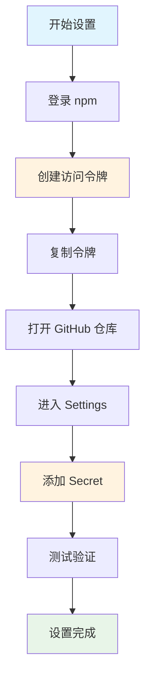

# 📸 可视化设置指南

本指南通过图解的方式展示如何设置 GitHub Secrets 和 NPM_TOKEN。

## 🎯 设置流程图



## 📦 第一部分：npm 设置

### 🔗 npm 网站导航路径

```
https://www.npmjs.com/ 
    ↓ 点击右上角
    👤 Sign In (登录)
    ↓ 登录成功后
    👤 头像下拉菜单
    ↓ 选择
    🔑 Access Tokens
    ↓ 点击
    ➕ Generate New Token
```

### 🎛️ 令牌配置选项

```
┌─────────────────────────────────────┐
│  Create New Token                   │
├─────────────────────────────────────┤
│  Token Type:                        │
│  ○ Granular Access Token            │
│  ● Classic Token        ← 选择这个   │
├─────────────────────────────────────┤
│  Token Name:                        │
│  [an-fetch-cicd        ]            │
├─────────────────────────────────────┤
│  Expiration:                        │
│  ● No Expiration       ← 推荐       │
│  ○ 30 days                          │
│  ○ 90 days                          │
│  ○ 1 year                           │
├─────────────────────────────────────┤
│  Access Level:                      │
│  ● Automation          ← 必须选择   │
│  ○ Read-only                        │
├─────────────────────────────────────┤
│         [Generate Token]            │
└─────────────────────────────────────┘
```

### 📋 令牌显示界面

```
┌─────────────────────────────────────┐
│  ⚠️  Token Created Successfully      │
├─────────────────────────────────────┤
│  Your new token:                    │
│                                     │
│  npm_K7x2mQ9vR8pL3nF6sD1wE4tY      │
│  ↑                                  │
│  立即复制这个令牌！只显示一次！        │
│                                     │
│  [ Copy to Clipboard ]              │
└─────────────────────────────────────┘
```

## 🐙 第二部分：GitHub 设置

### 🔗 GitHub 导航路径

```
https://github.com/你的用户名/an-fetch
    ↓ 点击标签页
    ⚙️ Settings
    ↓ 左侧菜单
    🔒 Security 部分
    ↓ 展开
    🔐 Secrets and variables
    ↓ 选择
    🎬 Actions
```

### 📍 Secrets 页面结构

```
┌─────────────────────────────────────┐
│  Actions secrets and variables      │
├─────────────────────────────────────┤
│  Repository secrets                 │
│                                     │
│  [ New repository secret ]  ← 点击  │
│                                     │
│  📝 Secrets:                        │
│  (暂无secrets)                      │
└─────────────────────────────────────┘
```

### 📝 添加 Secret 表单

```
┌─────────────────────────────────────┐
│  Add a new secret                   │
├─────────────────────────────────────┤
│  Name *                             │
│  [NPM_TOKEN             ]  ← 必须这样 │
│                                     │
│  Secret *                           │
│  ┌─────────────────────────────────┐ │
│  │npm_K7x2mQ9vR8pL3nF6sD1wE4tY    │ │
│  │                                 │ │
│  │  ← 粘贴你的npm令牌               │ │
│  └─────────────────────────────────┘ │
│                                     │
│         [ Add secret ]              │
└─────────────────────────────────────┘
```

### ✅ 成功添加后的显示

```
┌─────────────────────────────────────┐
│  Repository secrets                 │
├─────────────────────────────────────┤
│  📝 NPM_TOKEN                       │
│      ••••••••••••••••••••          │
│      Updated now by 你的用户名       │
│      [Update] [Remove]              │
└─────────────────────────────────────┘
```

## 🔍 第三部分：验证测试

### 🎬 GitHub Actions 页面

```
┌─────────────────────────────────────┐
│  Actions                            │
├─────────────────────────────────────┤
│  🔄 CI/CD Pipeline                  │
│      ✅ #1: Setup CI/CD             │
│      📅 2 minutes ago               │
│                                     │
│  🚀 Release Version                 │
│      [ Run workflow ]   ← 手动触发   │
└─────────────────────────────────────┘
```

### 📊 工作流执行状态

```
┌─────────────────────────────────────┐
│  CI/CD Pipeline #1                  │
├─────────────────────────────────────┤
│  ✅ test (18.x)          2m 15s     │
│  ✅ test (20.x)          2m 08s     │
│  ✅ build                1m 32s     │
│  🟡 publish              running... │
│     ├─ Check version     ✅         │
│     ├─ Publish to npm    🟡         │
│     └─ Create release    ⏳         │
└─────────────────────────────────────┘
```

## 🚨 错误状态指示

### ❌ 常见错误及显示

```
┌─────────────────────────────────────┐
│  ❌ 403 Forbidden Error              │
├─────────────────────────────────────┤
│  npm ERR! 403 Forbidden             │
│  npm ERR! You do not have permission│
│                                     │
│  💡 解决：检查包名或权限               │
└─────────────────────────────────────┘

┌─────────────────────────────────────┐
│  ❌ 401 Unauthorized Error           │
├─────────────────────────────────────┤
│  npm ERR! 401 Unauthorized          │
│  npm ERR! Invalid authentication    │
│                                     │
│  💡 解决：重新生成NPM_TOKEN           │
└─────────────────────────────────────┘
```

## 🎯 检查点清单

### 📋 npm 检查点

```
☐ npm 账户已创建
☐ 选择了 "Classic Token" 类型
☐ 访问级别设置为 "Automation"  
☐ 令牌已复制保存
☐ 包名可用或有权限
```

### 📋 GitHub 检查点

```
☐ 有仓库管理员权限
☐ 找到了 Settings → Secrets and variables → Actions
☐ Secret 名称是 "NPM_TOKEN"（区分大小写）
☐ Secret 值完整粘贴（包含 npm_ 前缀）
☐ Secret 添加成功
```

### 📋 验证检查点

```
☐ GitHub Actions 可以运行
☐ 没有权限错误
☐ 能看到详细执行日志
☐ npm 包可以正常发布
```

## 🔄 设置流程时间轴

```
🕐 0-2 分钟：npm 登录和令牌创建
🕑 2-4 分钟：GitHub Secrets 设置
🕒 4-6 分钟：验证和测试
🕓 6-8 分钟：问题排查（如果有）
🕔 8-10 分钟：设置完成
```

## 📱 移动端设置提醒

如果你在移动设备上设置：
- 📱 npm 网站在手机上可能显示不完整
- 💻 建议使用电脑浏览器
- 🔍 可以缩放页面查看完整内容

## 🎉 成功标志

设置成功后你会看到：

```
✅ GitHub Actions 显示绿色对勾
✅ npm 包页面显示新版本
✅ GitHub Releases 页面有新版本
✅ 邮件通知（如果开启了）
```

## 📞 获取帮助

遇到问题时的求助渠道：

```
1. 📖 查看详细文档：SETUP_SECRETS_GUIDE.md
2. 🐛 GitHub Issues：描述错误和截图
3. 📧 邮件：m18680602188@163.com
4. 💬 社区：Stack Overflow (tag: an-fetch)
```

---

**💡 小贴士：** 建议在设置过程中截图保存关键步骤，方便以后参考或求助时提供更多信息。